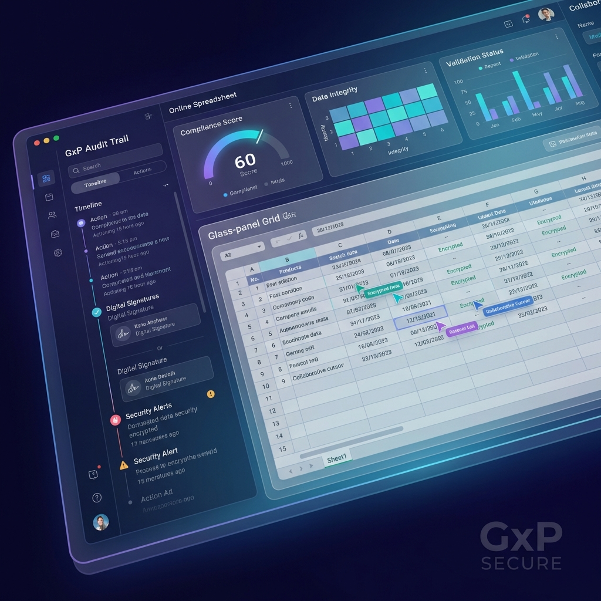

# Keep Quality | GxP Compliant Enterprise Spreadsheets

**Keep Quality** is a high-performance, online spreadsheet platform designed specifically for regulated industries. It enables organizations to manage scientific data, audit trails, and results with uncompromising compliance.



## 🚀 Key Features

- **Immutable Audit Trails**: Every action, formula change, and data entry is captured with cryptographic timestamps and user identification.
- **Electronic Signatures**: Fully compliant with FDA 21 CFR Part 11 and EU Annex 11 for document approval and data locking.
- **Hyperformula Engine**: Powered by Handsontable's Hyperformula, supporting thousands of complex scientific calculations with sub-millisecond latency.
- **Enterprise Governance**: Granular role-based access control (RBAC), centralized data repository, and real-time validation for laboratory data.
- **Compliance Ready**: Built from the ground up to meet the strictest standards:
  - FDA 21 CFR Part 11
  - GxP (GLP, GCP, GMP)
  - EU Annex 11
  - ISO 27001 Infrastructure

---

## 🛠 Development Information

This project was generated using [Angular CLI](https://github.com/angular/angular-cli) version 21.0.4.

### Getting Started

To start a local development server, run:

```bash
pnpm install
ng serve
```

Once the server is running, open your browser and navigate to `http://localhost:4200/`. The application will automatically reload whenever you modify any of the source files.

### Code Scaffolding

To generate a new component, run:

```bash
ng generate component component-name
```

For a complete list of available schematics (such as `components`, `directives`, or `pipes`), run `ng generate --help`.

### Building

To build the project for production:

```bash
ng build
```

This will compile your project and store the build artifacts in the `dist/` directory.

### Testing

#### Unit Tests

To execute unit tests with the [Vitest](https://vitest.dev/) test runner:

```bash
ng test
```

#### End-to-End Tests

For end-to-end (e2e) testing:

```bash
ng e2e
```

## 🔐 Supabase OIDC Integration

This project uses an OIDC provider (Zitadel) for authentication, which is exchanged for a Supabase JWT via an Edge Function (`exchange-jwt`).

### Production Configuration

#### 1. Frontend Environment (`.env`)

Ensure the following variables are set in your production environment:

- `SUPABASE_URL`: Your Supabase Project URL.
- `SUPABASE_KEY`: Your Supabase **Anon** Key.
- `OIDC_AUTHORITY`: Zitadel project authority URL.
- `OIDC_CLIENT_ID`: Zitadel application client ID.

#### 2. Supabase Edge Function Secrets

The `exchange-jwt` function requires the following secrets to be set in Supabase:

```bash
supabase secrets set ZITADEL_URL="https://same-oidc-authority"
supabase secrets set SB_JWT_SECRET="your-supabase-jwt-secret"
```

> [!IMPORTANT]
> `SB_JWT_SECRET` must match the **JWT Secret** found in your Supabase Project Settings -> API.

### Local Development

1. Create `supabase/functions/.env` from `.env.example`.
2. Run `supabase functions serve` locally.
3. Use the default local secret: `super-secret-jwt-token-with-at-least-32-characters-long`.

## Additional Resources

For more information on using the Angular CLI, including detailed command references, visit the [Angular CLI Overview and Command Reference](https://angular.dev/tools/cli) page.
